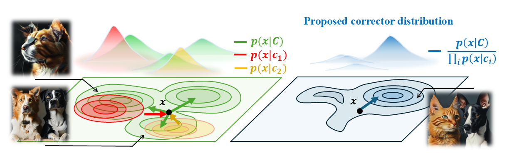

# (CO3) Steer Away From Mode Collisions: Improving Composition In Diffusion Models (ICLR'26), [PDF](https://openreview.net/pdf?id=NwgwWxrD0l) 

by Debottam Dutta, Jianchong Chen, Rajalaxmi Rajagopalan, Yu-Lin Wei, Romit Roy Choudhury

University of Illinois at Urbana-Champaign


## 🔎Overview

**CO3** is a gradient-free compositional guidance method for multi-concept text-to-image generation that addresses concept missing/fading issues by modifying the sampling distribution to avoid mode overlap. The method unifies correction and composable diffusion approaches through a Tweedie-mean composition framework. 


## 💡Why CO3 works?

#### 1. Our hypothesis
<p align="center">
 
</p>

For a given prompt $C$, T2I models like StableDiffusion sample from the modes of the learned distribution, $p(x \mid C)$. While such models produce high-resolution images, they are often misaligned for simple prompts containing few concepts (e.g., $C$ = "a cat and a dog"). This occurs due to the presence of problematic modes in $p(x \mid C)$. 

We hypothesize that problematic modes in $p(x \mid C)$ arise when they overlap with modes of individual concept distributions $p(x \mid c_i)$.
Such an overlap biases the generation toward a single concept $c_i$, reducing the prominence of others.

#### 2. Our Solution

We propose a cure for problematic modes. Our intuitive idea is to go away from problematic modes and move towards modes under which none of the individual concepts are strong.
To realize this, we propose  *Concept Contrasting Corrector (CO3)* that generates samples from the following distribution: 

$$\tilde{p}_t(x_t, C) \propto \frac{p_t(x_t \mid C)^{w_0}}{\prod_{k=1}^K p_t(x_t \mid c_k)^{w_k}}$$

This corrector distribution $\tilde{p}(x \mid C)$ assigns low probability to regions where $p(x \mid C)$ overlaps with individual $p(x \mid c_i)$. By suppressing these overlaps, the corrector emphasizes *pure* $p(x\mid C)$ modes where all concepts coexist without one overwhelming the others. 

## 🚀How to Run
### 1. Environment Setup

Create and activate the conda environment:

```bash
conda create -n co3 python=3.10
conda activate co3
pip install -r requirements.txt
```

download and install xformers which is compatible for your own environment in https://download.pytorch.org/whl/xformers/
Or you can try the command below
```
pip install -v --no-build-isolation --no-deps git+https://github.com/facebookresearch/xformers.git@main#egg=xformers
```

## Quick Start

### 1. Basic Usage

Run the example script:

```bash
bash run_sample_co3.sh
```
### 2. Evaluation on benchmarks (Coming Soon)  

## 📖Citation
```
@misc{dutta2025co3contrastingconceptscompose,
      title={CO3: Contrasting Concepts Compose Better}, 
      author={Debottam Dutta and Jianchong Chen and Rajalaxmi Rajagopalan and Yu-Lin Wei and Romit Roy Choudhury},
      year={2025},
      eprint={2509.25940},
      archivePrefix={arXiv},
      primaryClass={cs.CV},
      url={https://arxiv.org/abs/2509.25940}, 
}
```

## Acknowledgements

Our source code is based on [Tweediemix](https://github.com/KwonGihyun/TweedieMix/tree/main), [ToMe](https://github.com/hutaihang/ToMe) and [Diffusers](https://github.com/huggingface/diffusers). We thank the authors of these projects for their contributions and for making their code available.  
